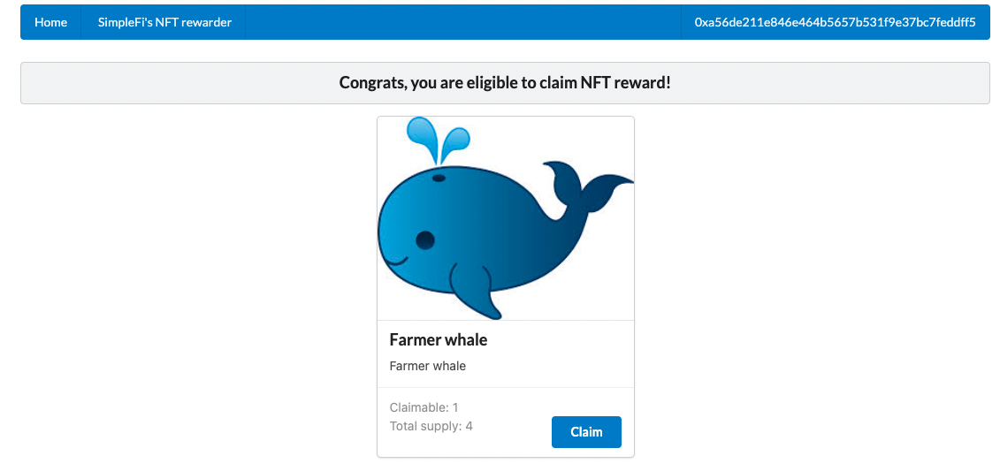
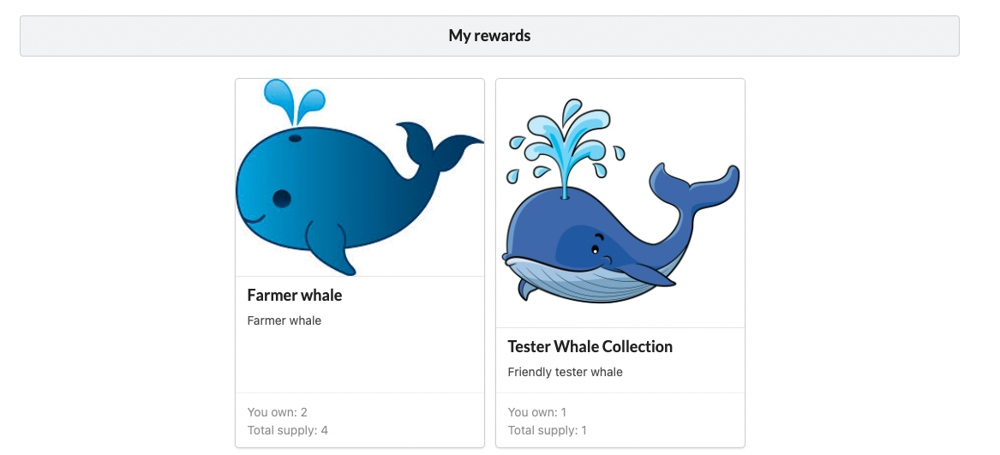

## Getting Started with Create React App

`npm i` to install dependencies

`npm start` start app in dev mode

## Frontend app for NFT rewarder

This is a simple frontend to showcase SimpleFi's NFT rewards system.

App will ask user to connect with Metamask. Then it will fetch 2 sets of information:

- list of claimable NFT rewards
- list of already claimed NFT rewards

Source for this information is rewarder subgraph, currently running here:

```
const SUBGRAPH_ENDPOINT = 'https://api.thegraph.com/subgraphs/name/gvladika/nft-rewarder';
```

## Claimable rewards component



## Claimed rewards component


